# Practicas Básicas

Este repositorio contiene algunos de los pasos que seguí al comenzar a aprender HTML, CSS, JavaScript, jQuery y Bootstrap.

<!-- This repository contains some of the steps I followed when starting to learn HTML, CSS, JavaScript, jQuery, and Bootstrap.
 -->
## Tecnologías Utilizadas

- **HTML5**: Experiencia en maquetación estructurada.
- **CSS**: Habilidades de estilización y diseño.
- **JavaScript**: Acceso al DOM, interactividad y manipulación de eventos.
- **jQuery**: Utilizado para manipulación y animación del DOM.
- **Bootstrap**: Integración de clases, estructuras y estilos.

## Proyectos Incluidos

- **Práctica de acceso y modificación del DOM**
- **Calculadora sencilla**
- **Formulario de inicio de sesión**
- **Práctica de local storage**
- **Reloj**
- **Diseño de un blog clásico**
- **Maquetación sencilla de una galería de fotos**
- **Práctica avanzada de jQuery con animaciones y eventos de teclado**
- **Biblioteca de recursos Bootstrap**

---
### Html y Css 

Conceptos básicos de la maquetación con html y css

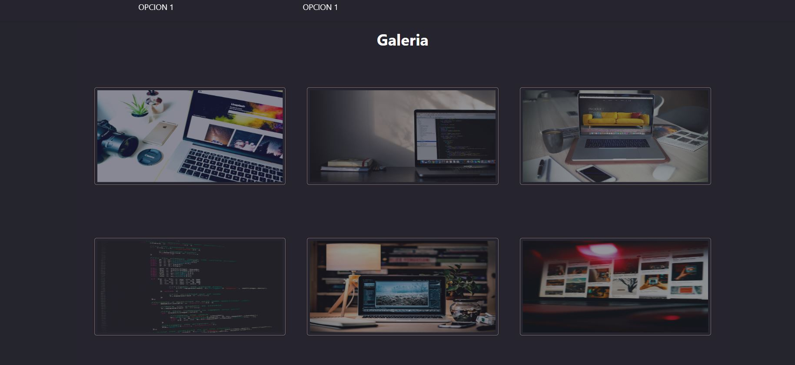
Maquetación sencilla de una galería con efectos hover

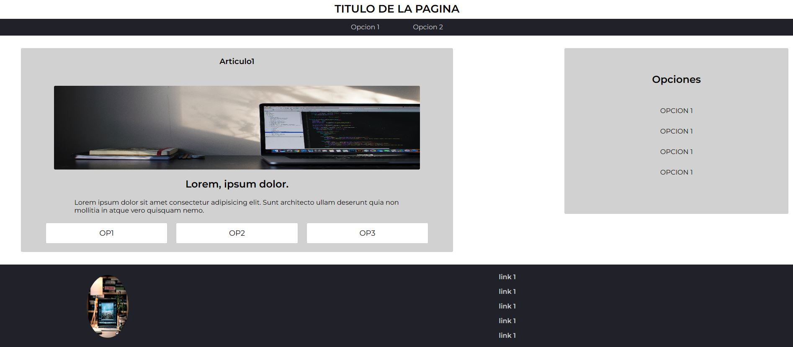
Layout clásico de un blog

---

## JavaScript

Ya tenia conocimientos básicos de javascript como variables, funciones, tipos de datos, condicionales y ciclos, por lo que en esta sección abarque mas que todo el manejo del dom, como obtener datos de formularios, modificar propiedades y valores de los elementos html a través de Javascript asi como animaciones con css y asignar eventos.

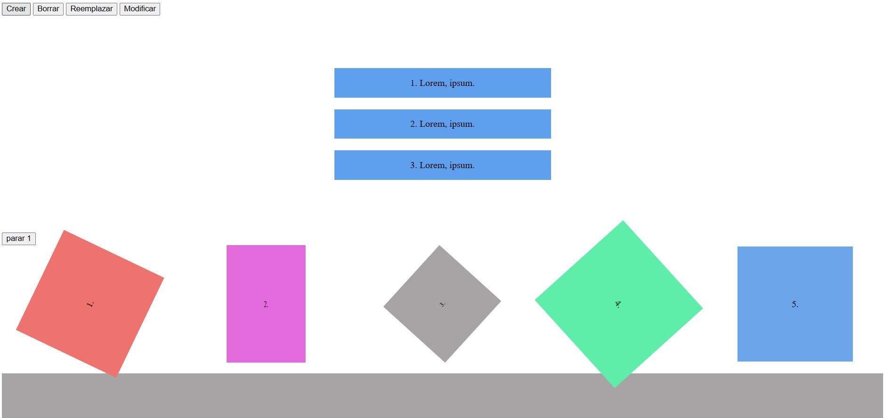
practica de manejo de dom, animaciones css mediante keyframe y asignación de eventos.

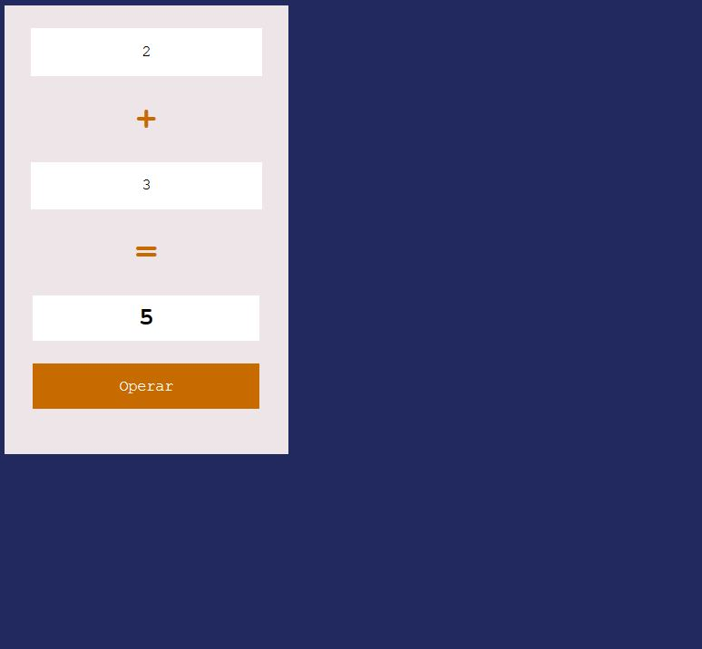
practica de obtenciones de los valores de entrada a través de js.

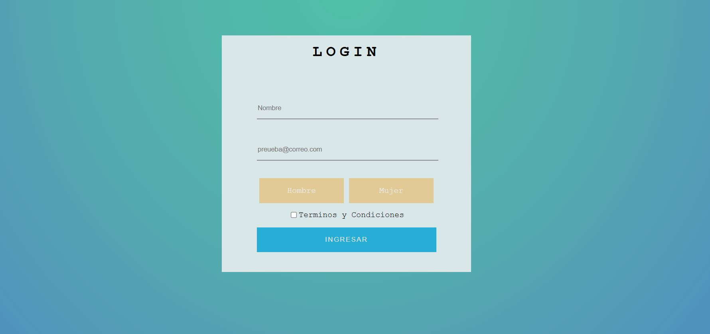
Una practica en la que juntamos todos los conocimientos adquiridos hasta el momento para realizar un formulario de inicio de sesión sencillo.

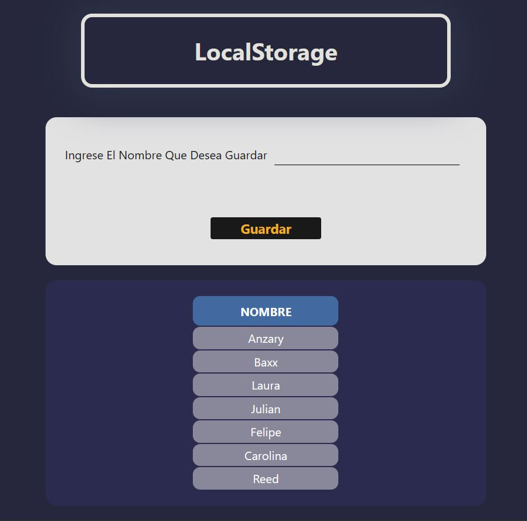
Practica en la que se pretende obtener valores de entrada a través de un input y posteriormente guardarlos y obtenerlos del localStorage

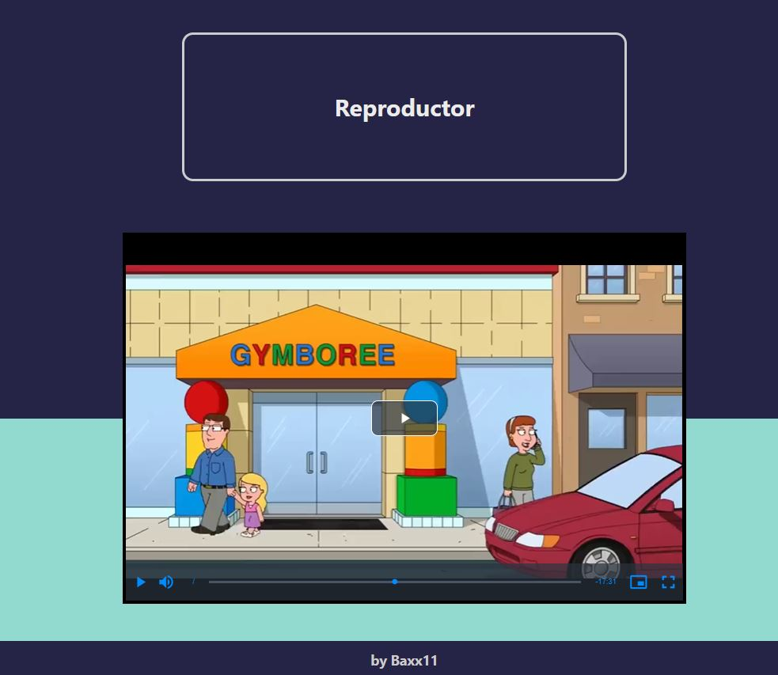
Hice uso de la librería reproductorJs para estilar un reproductor de video.

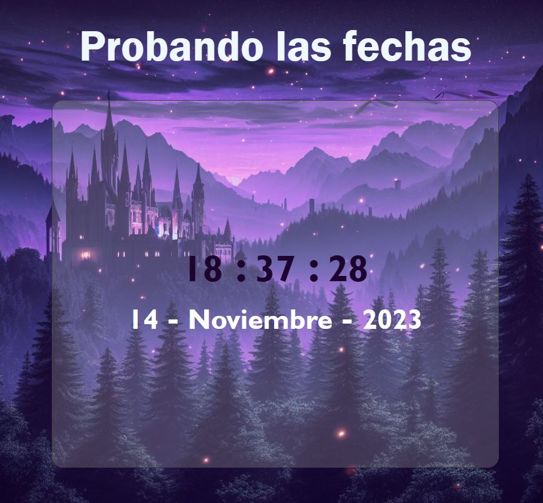
Manejo de fechas e intervalos.

---
### Jquery

Jquery es una biblioteca de javascript que nos permite acceder fácilmente al Dom, animar y y manejar eventos entre otras funcionalidades.

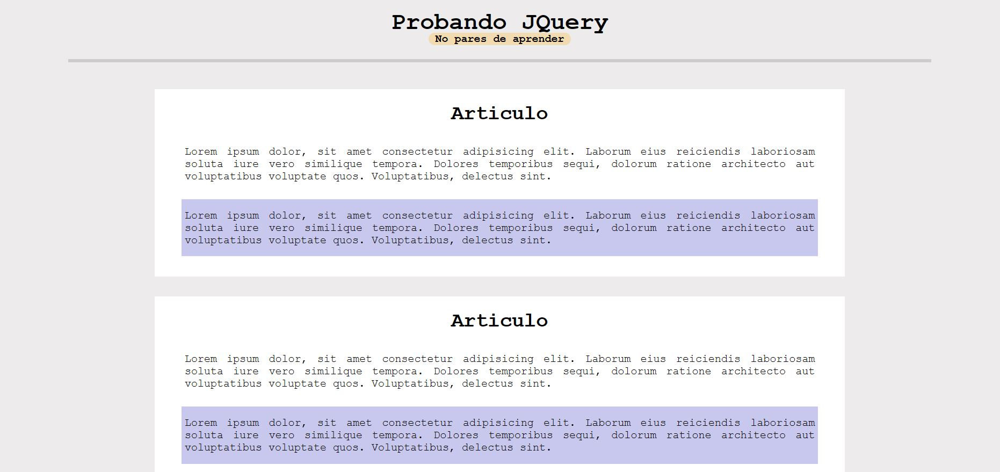
primeros paso con jquery, obtenemos los elementos html a traves de Jquery y modificamos sus estilos

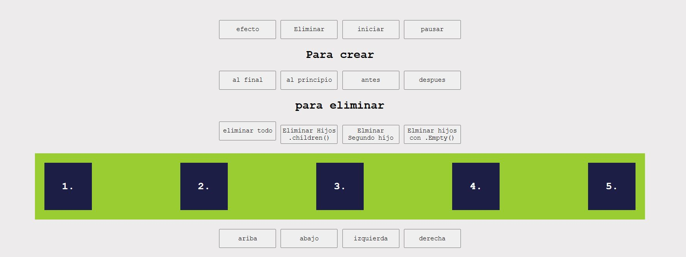
Acciones de manipulación del dom, eliminar, agregar o mover elementos, asi como agregar animaciones.

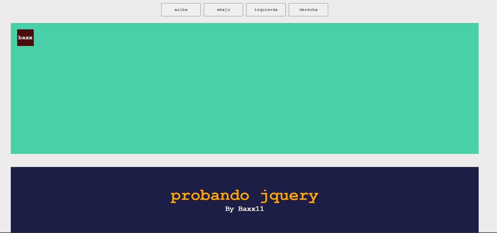
Eventos de teclado por medio de JQuery.

---
### Bootstrap

Bootstrap es un framework de CSS que permite agilizar el estilado de las paginas web al usar clases y estilos que ya se encuentran definidos, permite crear paginas web responsivas fácilmente ya que se usa una estructura recomendada por el framework.

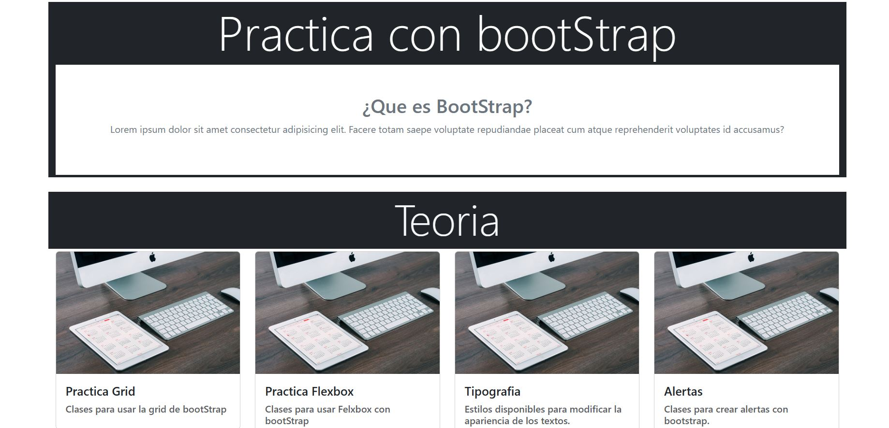
Un repositorio que contiene algunos ejemplos de los elementos y estilos que permite usar bootstrap.

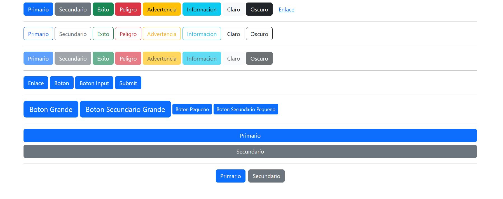
muestra de el ejemplo de botones que incluye bootstrap por defecto.

---

### Aprendizaje y Recursos

Durante este viaje, he consultado documentación, artículos y videos en línea. Además, he participado en cursos en Udemy como parte del programa MisionTic, enriqueciendo mi comprensión y habilidades.

### Ampliando el Horizonte

Además de los ejemplos mostrados y las tecnologías mencionadas, he explorado el uso de Figma y WordPress como herramientas complementarias en mi arsenal de desarrollo.